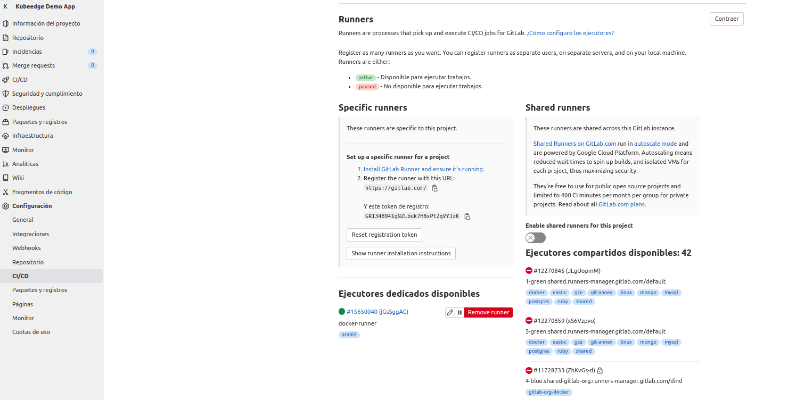
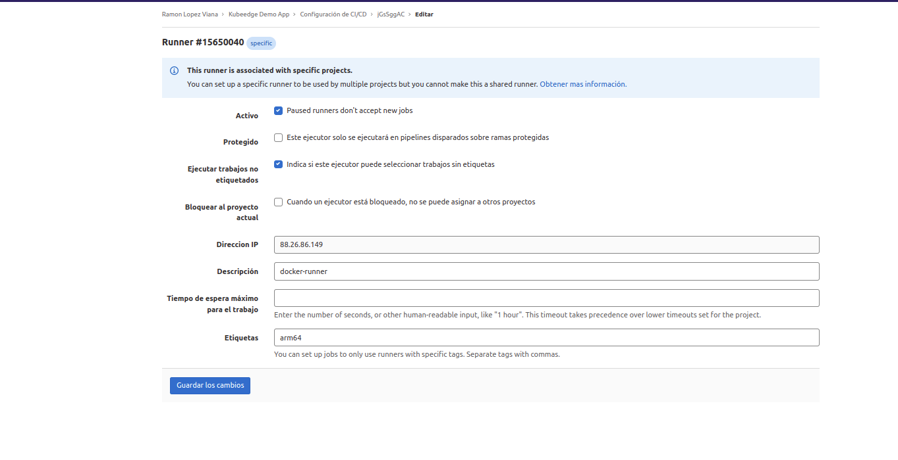

# DevOps infrastructure for lab development

This repository contains instructions for creating a basic DevOps infrastructure able to implement CI/CD pipelines.

In order to allow to create such infrastructure in lab environments docker has been used as runtime for them creating the required docker-compose files for each one.

The tools included are:

- [gitlab](gitlab), that will act as a git provider and allows the definition of worflow pipelines using a descriptive language.

- [nexus](nexus), one of the most extented tools for hosting artifact repositories supporting a wide range of languages (java, npm, Docker, etc).

- [registry](registry), the most simple docker registry available based implemented by Docker themshelf.

- [sonarQube](sonar), may be the most used tool for quality assurance allowing integration will a pletora of languages. 

For every docker-compose file an *.env* file has been included that will allow to configure the tools. This includes tool version, volumes location, etc.

Since in most cases only basic tool installation is provided, it´s recommended to reviw the tool documentation. In the reference section links for every tool are provided.

## Usage

For every tool a *docker-compose* file so starting, stoping, etc. can be done the usual way

```ssh
$ docker-compose up
$ docker-compose down
$ docker-compose rm -v #remove orphaned volumes.
```


# General configuration

If the environment is instantiated using only one machine it will be required to include the DNS entries required to resolve the DNS for each tool (i.e. modifying /etc/hosts file in osx or linux distributions)

The host system for docker and the images used must be supported, *amd64* is the recommended one.

## Requirements
 
Host Machine

- Docker
- Docker Compose

Internet Access.

# Gitlab
This repository includes the required elements to creeate a CI/CD enviroment in a lab environment. It' based in docker-compose that provides a flexible and customizable way to adapt it to the environment requirements.

## Gitlab
The compose file provided allows to bring up a full gitlab instance including CI capabilities that will allow to define the required workflows.

Since Gitlab allows OMNIBUS configuration, the instance can be configured for better performance removing not required services. Please refer to gitlab documentation for configuring it.

The initial admin password can be obtained executing

```sh
docker exec gitlab cat /etc/gitlab/initial_root_password
```

An .env file is included for customizing:
- Tools version
- Volumes location.

Instructions for creating external runners have been included. In this case for a Rapsberry Pi (Buster) since its architecture it's not supported in amd64 and executing or building docker images requires it.


### Baremetal Gitlab Runner

In some cases is required to install a baremetal gitlab runner. In most cases is related with special requirements of the tasks to executo o the architecture required to build an artifact.

#### Gitlab Runner Raspbian Buster

Gitlab runner is sopported in many platforms, using the docker image provided by Gitlab or using the binary provided by Gitlab.  
Now the installation of a gitlab runner in a Raspberry PI (Buster/arm64) are provided.

**Steps** 

1. Install git

```ssh
sudo apt-get update && sudo apt-get upgrade

sudo apt-get install git

```

Once installed the succesful installation can be verified

```ssh
git --version
```

2. If the runner requires docker

```ssh

curl -sSL https://get.docker.com | sh

sudo usermod -aG docker pi

newgroup docker
```

3. Install gitlab runner

Follow the instructions provided by GitLab in this [link](https://docs.gitlab.com/runner/install/linux-manually.html)

#For Raspberry Pi Buster

```ssh
sudo curl -L --output /usr/local/bin/gitlab-runner "https://gitlab-runner-downloads.s3.amazonaws.com/latest/binaries/gitlab-runner-linux-arm"

sudo chmod +x /usr/local/bin/gitlab-runner

sudo useradd --comment 'GitLab Runner' --create-home gitlab-runner --shell /bin/bash

sudo gitlab-runner install --user=gitlab-runner --working-directory=/home/gitlab-runner

sudo gitlab-runner start
```

#For Raspberry Pi Linux arm64

```ssh
sudo curl -L --output /usr/local/bin/gitlab-runner "https://gitlab-runner-downloads.s3.amazonaws.com/latest/binaries/gitlab-runner-linux-arm64"

sudo chmod +x /usr/local/bin/gitlab-runner

sudo useradd --comment 'GitLab Runner' --create-home gitlab-runner --shell /bin/bash

sudo gitlab-runner install --user=gitlab-runner --working-directory=/home/gitlab-runner

sudo gitlab-runner start
```

Then an executor can be registered in the runner. Since there are several options and executor types is recomended to check GitLab [documentation](https://docs.gitlab.com/runner/executors/)

Runners can be registered at group or project level (under config). It provides the token required for registrtion:  




Oneliner for registering an executor (docker based)

```ssh
sudo gitlab-runner register \
  --non-interactive \
  --url "https://gitlab.com/" \
  --registration-token "$REGISTRATION_TOKEN" \
  --executor "docker" \
  --docker-image alpine:latest \
  --description "docker-runner" \
  --tag-list "docker" \
  --run-untagged="true" \
  --locked="false" 
  --access-level="not_protected"
```


An example config.toml for a docker runner (allowing dind) in raspberry pi (arm64)

```
concurrent = 2
check_interval = 0

[session_server]
  session_timeout = 1800

[[runners]]
  name = "docker-runner"
  url = "https://gitlab.com/"
  token = "jGsSggACkDW8sNeE5xxZ"
  executor = "docker"
  [runners.custom_build_dir]
  [runners.cache]
    [runners.cache.s3]
    [runners.cache.gcs]
    [runners.cache.azure]
  [runners.docker]
    tls_verify = false
    image = "alpine:latest"
    privileged = true
    disable_entrypoint_overwrite = false
    oom_kill_disable = false
    disable_cache = false
    volumes = ["/cache", "/var/run/docker.sock:/var/run/docker.sock"]
    shm_size = 0
```

Once registered the detail an status can be checked in group or project runners



4. Happy runing1

*Note*

If using docker an receiving the following message:

```
failed to find memory cgroup
```

It's required to modify boot options:

- Raspbian Buster

  Modify */boot/cmdline.txt* adding

    ```
    cgroup_memory=1 cgroup_enable=memory
    ```

- Ubuntu 21LTS

    Modify */boot/firmware/cmdline.txt* adding

    ```
    cgroup_enable=cpuset cgroup_enable=memory cgroup_memory=1
    ```

## Nexus

The compose file provided bring up a full Nexus OSS instance exposing ports:
- 8081 for artifacts
- 5000 & 5001 for docker registry.  

An .env file is included for customizing:
- Tools version
- Volumes location.

To obtain initial credentials:

```sh
docker exec nexus3 cat /nexus-data/admin.password
```

*Notes*

> If not ussing trusted certificates it's required to modify docker options file */etc/docker/daemon.json* to include the registries as trusted unsecured.


> If problems are found mounting data volume, review the permissions in the directory or use volumes.

```
"insecure-registries" : [
     "registry.nexus",
     "http://registry.nexus:5000"
   ]
```

#### Configuration

    Please refer to [nexus documentation](https://help.sonatype.com/repomanager3/nexus-repository-administration) for configuring repositories and users.


## SonarQube

The compose file provided bring up a basic SonarQube instance that includes the plugin  OSS instance exposing ports:
- 9000 for access

An .env file is included for customizing:
- Tools version
- Volumes location.

The docker-compose file includes the definition of an external postgre database that will be used for SonarQube.

Default username/password: admin/admin

**Note**

> If following error appears in log

```txt
sonarqube       | ERROR: [1] bootstrap checks failed. You must address the points described in the following [1] lines before starting Elasticsearch.
sonarqube       | bootstrap check failure [1] of [1]: max virtual memory areas vm.max_map_count [65530] is too low, increase to at least [262144]

```
> Execute the following

```sh
sudo sysctl -w vm.max_map_count=524288
sudo sysctl -w fs.file-max=131072
```

#### Configuration

    Please refer to [sonarqube documentation](https://docs.sonarqube.org/latest/) for configuration, including the required language analysis configuration.


## References

- Gitlab
    - [Reference](https://about.gitlab.com/)
    - [Docker](https://hub.docker.com/r/gitlab/gitlab-ce)
    - [Gitlab Runner](https://docs.gitlab.com/runner/)
- Nexus
    - [Reference](https://www.sonatype.com/products/repository-oss)
    - [Docker](https://hub.docker.com/r/sonatype/nexus3)
- Registry
    - [Reference](https://docs.docker.com/registry)
    - [Docker](https://hub.docker.com/_/registry)

- SonarQube
    - [Reference](https://docs.sonarqube.org/latest/)
    - [Docker](https://hub.docker.com/_/sonarqube)

## TODO  

[ ] Automatic provissioning of gitlab runners  
[ ] Omnibus configuration for GitlabCI
